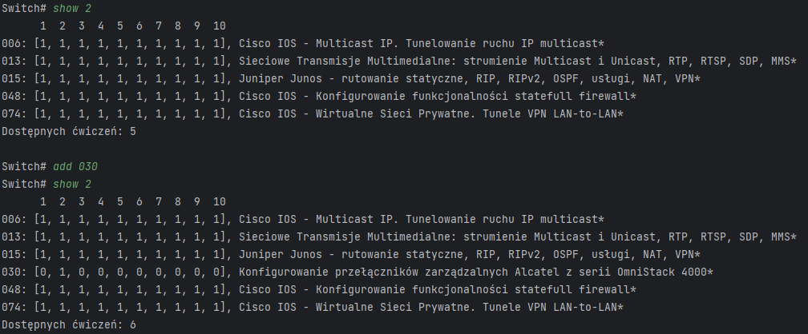

# Computer Networks Stations Problem

A simple program created for Computer Networks Course. Its main goal is to give the user a list of exercises that are possible to do on the given stations. It is built using Python 3 and BeautifulSoup library.

## Overview

- Web scraping is used to get the information about all exercises (id, description, stations it can be done on) from the provided website.
- Not all exercises on the website are available, so user provides the numbers of available exercises to the `exercises.txt` file.
- App works in console and is intended to resemble Cisco CLI (use cmd for better UX).
- User communicates with the app using commands.

## Project structure

- `main.py`: Entry point of the application.
- `commands.py`: Contains code for commands given by user.
- `exercise.pu`: Defines the `Exercise` class.
- `exercises.txt`: Contains the list of available exercises.

## Commands descriptions

Current version supports 5 commands that user can type into the console:

- `show` - takes in station numbers as arguments and returns a list of all the exercises that can be done on at least one of them and their amount. All arguments are separated by a singular space. If no arguments are provided, a list of all available exercises is returned.
- `no show` - takes in station numbers as arguments and returns a list of exercises that are impossible to be done on any of them and their amount. All arguments are separated by a singular space.
- `add` - takes in exercise numbers as arguments and adds them to `exercises.txt`. All arguments are separated by a singular space.
- `no add` - takes in exercise numbers as arguments and removes them from `exercises.txt`. All arguments are separated by a singular space.
- `shutdown` - turns off the app.

## Commands examples

- `show` - the components of each returned exercise are: number, list containing information whether it is possible (1) or not (0) to do it on the given station and a short description.  
- `no show` - components of each returned exercise are the same as in `show`.  
- `add`  
- `no add`  

## Getting started

### Prerequisites
Python 3.x installed on your system.

### Installation
1. Clone the repository    
   - `git clone https://github.com/MrWlobo/ComputerNetworksStationsProblem.git`
   - `cd ComputerNetworksStationsProblem`
2. Install libraries from `requirements.txt`   
    - `pip install -r requirements.txt`

### Usage
Open the `main.py` file to run the program.